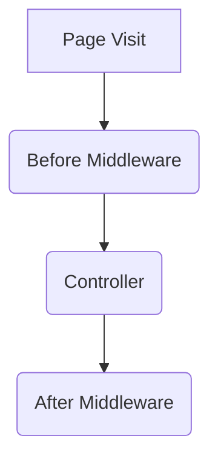

# Middleware

In PHP, the interpreter runs code one line at a time.
This makes PHP one of the best suited languages for writing Middleware.

In runtimes like node.js - you can't get the final HTTP status code for a request inside middleware.

That can only happen in the controller, if you store the entire response before sending.

Anyone that has attempted logging HTTP statuses in node middleware will know the pain.

## What is middleware?

As you might have guessed by the name, middleware sits in the middle.

But in the middle of what?



To explain the diagram in simple terms.

### Before Middleware

The first middleware is what's known as _Before Middleware_, as the name implies it is executed **before** the request even hits the router.

### After Middleware

The last middleware in the sequence, is known as _After Middleware_.
This will be executed after the controller has returned or finished execution.

Here you would normally log the response code. I'd recommend that you log all requests in non production environments.

In production you should either turn off logging, if you parse NGINX access logs or only log non successful responses.
This of course depends on the amount of requests you'll be receiving. Anything more than 100k requests per month **MUST** not log it in the application.
Use the available resources wisely. It costs money after all. Parsing NGINX logs is much less resource intensive, as you can do it on an async worker - and then ship exception logs to a sentry server.

#### Sample 1 - Logging a HTTP Response

Here we'll log the HTTP Response contents and the status code.

```php
<?php

namespace App\Http\Middleware;

use Closure;

class AfterMiddleware
{
    /**
    * @param \Illuminate\Http\Request $request
    * @param Closure $next
    * @return \Illuminate\Http\Response
    */
    public function handle($request, Closure $next)
    {
        /** @var \Illuminate\Http\Response $response */
        $response = $next($request);
        
        $access = [
            'http_status'   => $response->status(),
            'method'        => $request->message(),
            'fullURl'       => $request->fullUrl(),
            'secure'        => $request->secure(),
            'url'           => $request->url(),
            'ip'            => $request->ip(),
            'origin'        => $request->header('origin'),
            'ua'            => $request->userAgent(),
            'fingerprint'   => $request->fingerprint(),
        ];
        
        \Log::channel('access')->log($access);

        return $response;
    }
}
```
